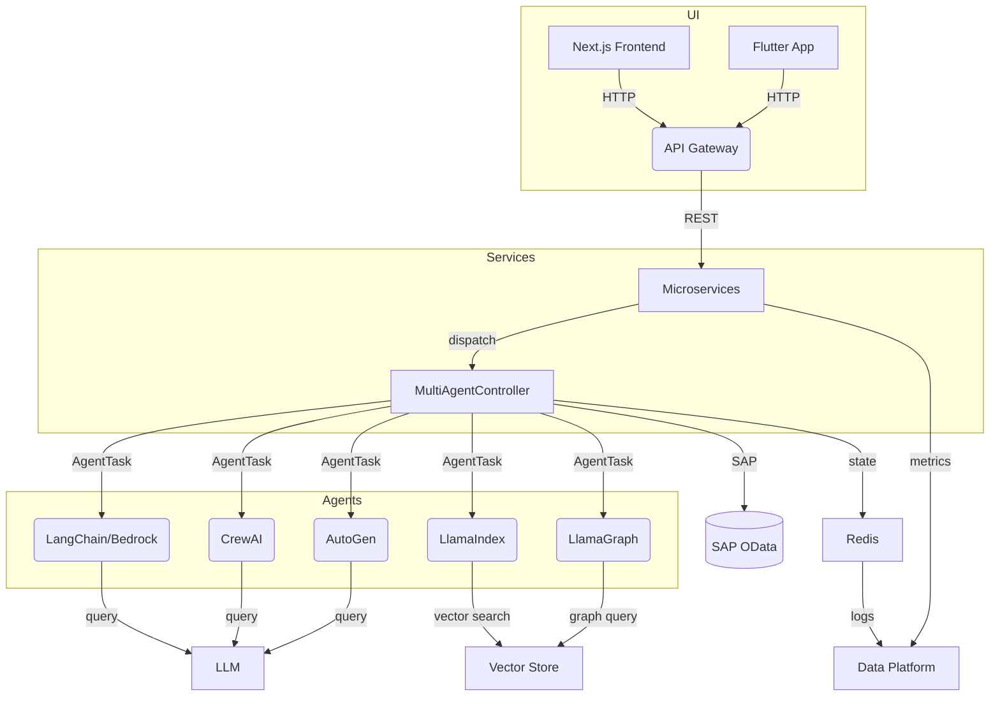

# Architecture

This document illustrates the high level architecture of the Enterprise platform and how the different agents interact with each other, with SAP and with the vector stores.

## Components

- **User Interfaces** – Next.js frontend and Flutter mobile app.
- **Microservices** – REST/HTTP APIs implemented in NestJS, FastAPI, Actix and Gin.
- **MultiAgentController** – dispatches tasks to GenAI agents.
- **Agents** – wrappers around LLM frameworks (LangChain, AutoGen, CrewAI, LlamaIndex, etc.).
- **SAP Integration** – utilities to call SAP systems via BTP Destination Service.
- **Vector Stores** – MongoDB Atlas Vector Search and S3 for embeddings.
- **Redis** – coordination and chat context persistence.
- **Data Platform** – dbt models, Athena/Glue configuration and ClickHouse for analytics.

## Data and Control Flow

1. Users interact with the Next.js or Flutter applications.
2. Requests are routed through the microservices layer which then uses the `MultiAgentController` to run tasks across the configured agents.
3. Agents call LLM providers (e.g. AWS Bedrock or OpenAI), query SAP systems and retrieve embeddings from the vector stores. They persist state and chat context in Redis.
4. Usage data and logs feed into the data platform for analytics and dashboards.

## Deployment Overview

- Infrastructure resources (Redis, Bedrock, MongoDB Atlas, SAP BTP connectors) are provisioned via Terraform modules in `infra/`.
- Each app has a Dockerfile for containerized deployment on Kubernetes or any container platform.
- CI/CD pipelines build and test the workspace and deploy to the target environment when changes land on `main`.

Refer to [README.md](README.md) for setup instructions.
